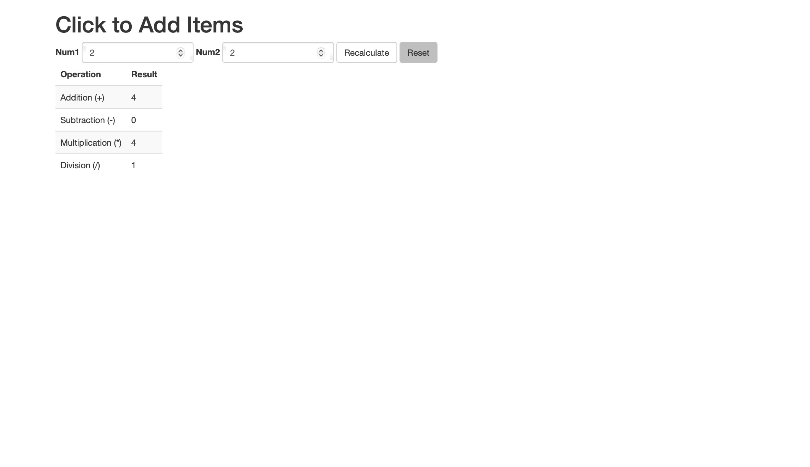
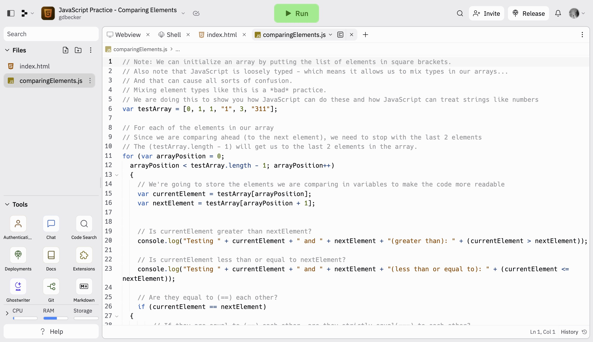
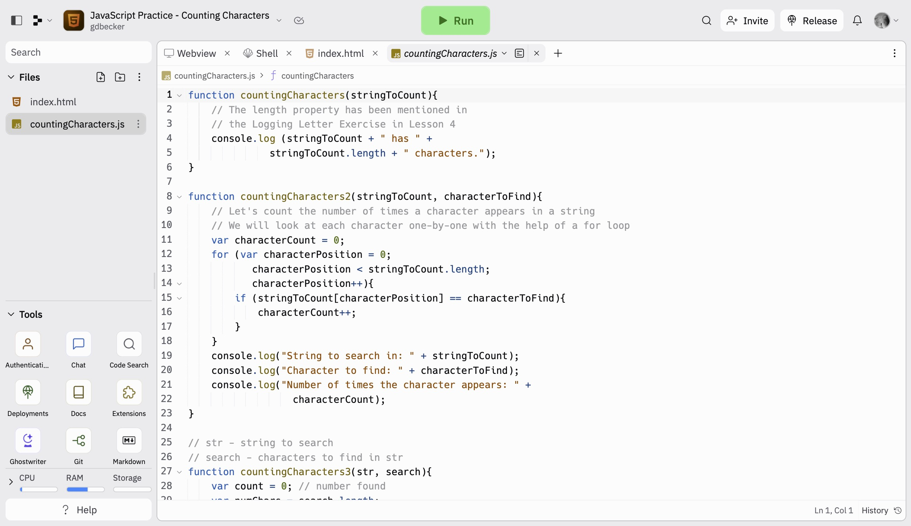
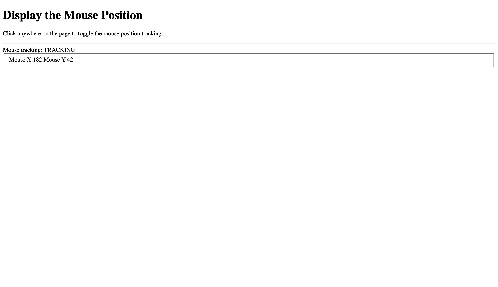
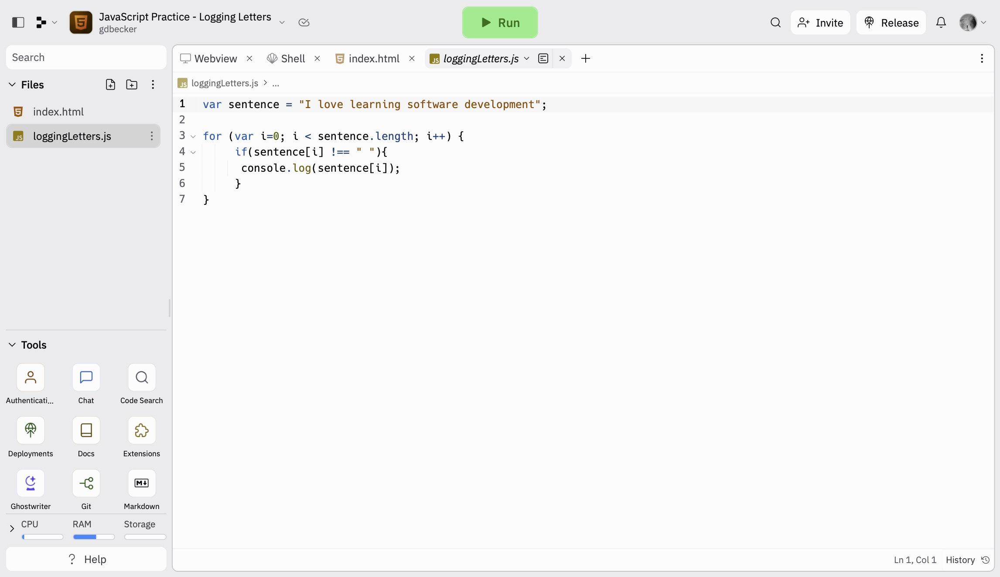
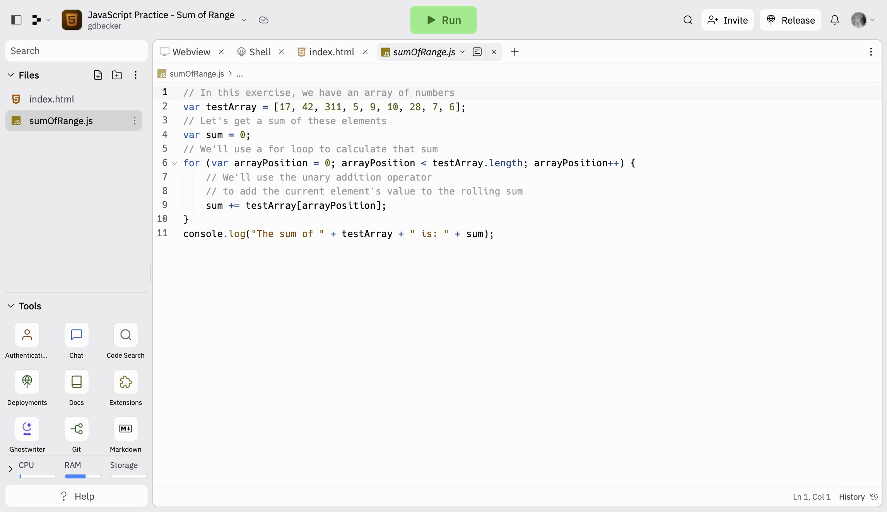

# JavaScript Practice

Practicing various problems with JavaScript

### Demo View

Click to Add Items

Comparing Elements

Counting Characters

Display Mouse Position

Logging Letters

Sum of Range

### Links

- [Live Demo - Click to Add Items](https://replit.com/@gdbecker/JavaScript-Practice-Click-to-Add-Items)
- [Live Demo - Comparing Elements](https://replit.com/@gdbecker/JavaScript-Practice-Comparing-Elements)
- [Live Demo - Counting Characters](https://replit.com/@gdbecker/JavaScript-Practice-Counting-Characters)
- [Live Demo - Display Mouse Position](https://replit.com/@gdbecker/JavaScript-Practice-Display-Mouse-Position)
- [Live Demo - Logging Letters](https://replit.com/@gdbecker/JavaScript-Practice-Logging-Letters)
- [Live Demo - Sum of Range](https://replit.com/@gdbecker/JavaScript-Practice-Sum-of-Range)

## Author

- Website - [Garrett Becker]()
- Replit - [@gdbecker](https://replit.com/@gdbecker)
- LinkedIn - [Garrett Becker](https://www.linkedin.com/in/garrett-becker-923b4a106/)